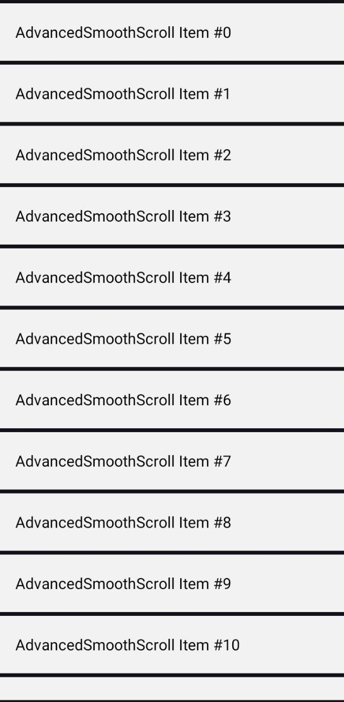
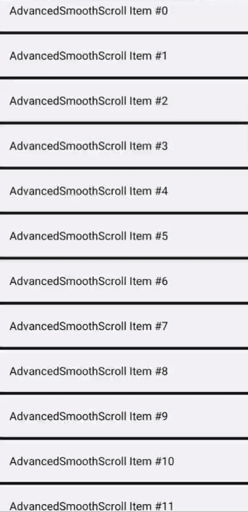

## AdvancedSmoothScroll
[](https://kotlinlang.org/)
[](LICENSE)
[](#)
---

AdvancedSmoothScroll is a lightweight Android Kotlin library that improves scrolling behavior for RecyclerView and NestedScrollView by providing smoother fling physics, customizable scrolling behavior, and optional spring-style overscroll.

It is designed to be:

✅ Easy to integrate

✅ Highly configurable

✅ Safe (no reflection / no private APIs)

✅ Production-ready

---

## Preview

<p align="center">
<table>
  <tr>
    <td align="center">
      
    </td>
    <td align="center">
      
    </td>
  </tr>
</table>
</p>

---

## Installation (JitPack)

### 1️⃣ Add JitPack to your **root `settings.gradle` or `build.gradle`**

```gradle
dependencyResolutionManagement {
    repositories {
        google()
        mavenCentral()
        maven { url 'https://jitpack.io' }
    }
}
```
### Add Dependency
```
dependencies {
	        implementation 'com.github.Excelsior-Technologies-Community:AdvancedSmoothScroll:1.0.0'
	}
```
---

## Features

1. Ultra-smooth scrolling for RecyclerView

2. Configurable fling behavior

3. Physics-based smooth scrolling

4. Optional spring-style overscroll (RecyclerView only)

5. XML + Kotlin API

6. Clean and minimal public surface

## Attributes

**SmoothRecyclerView XML Attributes**
| Attribute | Type | Default | Description |
|---------|------|---------|-------------|
| `app:flingMultiplier` | float | `0.85` | Controls how fast scrolling slows down after a fling. Lower values result in smoother and slower scrolling. |
| `app:enableSmoothPhysics` | boolean | `true` | Enables or disables custom smooth scrolling behavior. |
| `app:enableSpringOverscroll` | boolean | `true` | Enables spring-style overscroll instead of the default glow effect (RecyclerView only). |

**SmoothNestedScrollView XML Attributes**
| Attribute | Type | Default | Description |
|---------|------|---------|-------------|
| `app:flingMultiplier` | float | `0.8` | Controls vertical fling smoothness for NestedScrollView. Lower values create a calmer scrolling experience. |


---

## Supported Views
| Views	Supported |
|----------------|
| RecyclerView |
| NestedScrollView (smooth fling only) |
| Spring Overscroll RecyclerView only |

---

## Usage

**RecyclerView (Recommended)**

XML Usage
```xml
<com.ext.smoothscroll.recycler.SmoothRecyclerView
    android:id="@+id/recyclerView"
    android:layout_width="match_parent"
    android:layout_height="match_parent"
    app:flingMultiplier="0.6"
    app:enableSmoothPhysics="true"
    app:enableSpringOverscroll="true" />
```
Kotlin Usage
```kotlin
recyclerView.layoutManager =
    UltraSmoothLayoutManager(this)

recyclerView.adapter = MyAdapter()
```

**NestedScrollView**

XML Usage
```xml
<com.ext.smoothscroll.nested.SmoothNestedScrollView
    android:layout_width="match_parent"
    android:layout_height="match_parent"
    app:flingMultiplier="0.8">
    
    <!-- Your content -->
    
</com.ext.smoothscroll.nested.SmoothNestedScrollView>
```

---

## Example Usage

XML
```xml
<?xml version="1.0" encoding="utf-8"?>
<LinearLayout xmlns:android="http://schemas.android.com/apk/res/android"
    xmlns:app="http://schemas.android.com/apk/res-auto"
    xmlns:tools="http://schemas.android.com/tools"
    android:id="@+id/main"
    android:orientation="vertical"
    android:layout_width="match_parent"
    android:layout_height="match_parent"
    tools:context=".MainActivity">

    <com.ext.smoothscroll.recycler.SmoothRecyclerView
        android:id="@+id/recyclerView"
        android:layout_width="match_parent"
        android:layout_height="match_parent"
        app:flingMultiplier="0.5"
        app:enableSpringOverscroll="true"
        app:enableSmoothPhysics="true" />

</LinearLayout>
```
Kotlin
```kotlin
import android.os.Bundle
import androidx.activity.enableEdgeToEdge
import androidx.appcompat.app.AppCompatActivity
import androidx.core.view.ViewCompat
import androidx.core.view.WindowInsetsCompat
import androidx.recyclerview.widget.LinearLayoutManager
import com.ext.smoothscroll.recycler.SmoothRecyclerView
import com.ext.smoothscroll.recycler.UltraSmoothLayoutManager

class MainActivity : AppCompatActivity() {
    override fun onCreate(savedInstanceState: Bundle?) {
        super.onCreate(savedInstanceState)
        enableEdgeToEdge()
        setContentView(R.layout.activity_main)
        ViewCompat.setOnApplyWindowInsetsListener(findViewById(R.id.main)) { v, insets ->
            val systemBars = insets.getInsets(WindowInsetsCompat.Type.systemBars())
            v.setPadding(systemBars.left, systemBars.top, systemBars.right, systemBars.bottom)
            insets
        }
        val recyclerView = findViewById<SmoothRecyclerView>(R.id.recyclerView)

        recyclerView.layoutManager = UltraSmoothLayoutManager(this)

        recyclerView.adapter = SimpleAdapter(
            List(150) { "AdvancedSmoothScroll Item #$it" }
        )

        // OPTIONAL: Test smooth scroll programmatically
        recyclerView.postDelayed({
            recyclerView.smoothScrollToPosition(80)
        }, 1500)
    }
}
```
---

## Best Use Cases

-> Large RecyclerView lists

-> Reading-heavy screens

-> Premium UI experiences

-> Apps requiring fine scroll control

---

## License

```
MIT License

Copyright (c) 2025 Excelsior Technologies 

Permission is hereby granted, free of charge, to any person obtaining a copy
of this software and associated documentation files (the "Software"), to deal
in the Software without restriction, including without limitation the rights
to use, copy, modify, merge, publish, distribute, sublicense, and/or sell
copies of the Software, and to permit persons to whom the Software is
furnished to do so, subject to the following conditions:

The above copyright notice and this permission notice shall be included in all
copies or substantial portions of the Software.

THE SOFTWARE IS PROVIDED "AS IS", WITHOUT WARRANTY OF ANY KIND, EXPRESS OR
IMPLIED, INCLUDING BUT NOT LIMITED TO THE WARRANTIES OF MERCHANTABILITY,
FITNESS FOR A PARTICULAR PURPOSE AND NONINFRINGEMENT. IN NO EVENT SHALL THE
AUTHORS OR COPYRIGHT HOLDERS BE LIABLE FOR ANY CLAIM, DAMAGES OR OTHER
LIABILITY, WHETHER IN AN ACTION OF CONTRACT, TORT OR OTHERWISE, ARISING FROM,
OUT OF OR IN CONNECTION WITH THE SOFTWARE OR THE USE OR OTHER DEALINGS IN THE
SOFTWARE.
```
